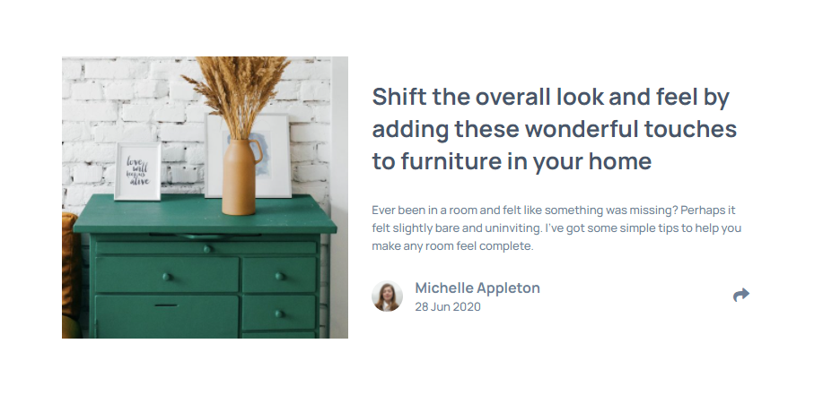
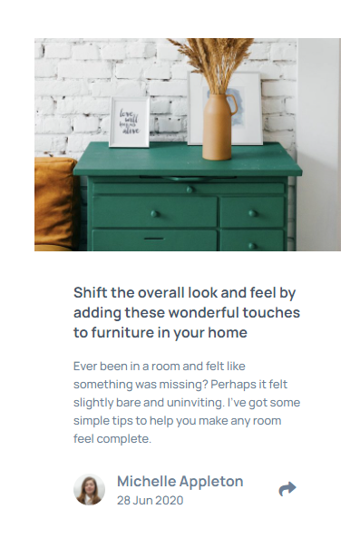

# Frontend Mentor - Article preview component solution

This is a solution to the [Article preview component challenge on Frontend Mentor](https://www.frontendmentor.io/challenges/article-preview-component-dYBN_pYFT). Frontend Mentor challenges help you improve your coding skills by building realistic projects.

## Table of contents

- [Overview](#overview)
  - [The challenge](#the-challenge)
  - [Screenshot](#screenshot)
  - [Links](#links)
  - [Built with](#built-with)
  - [Useful resources](#useful-resources)
- [Author](#author)
- [Acknowledgments](#acknowledgments)

## Overview

### The challenge

Users should be able to:

- View the optimal layout for the component depending on their device's screen size
- See the social media share links when they click the share icon

### Screenshot

### Links

- Solution URL: [https://www.frontendmentor.io/solutions/article-preview-component-flexbox-bem-javascript-6kfqHHCRH]()
- Live Site URL: [https://brkcln.github.io/Article-preview-component/]()

### Built with

- Semantic HTML5 markup,
- Flexbox,
- BEM,
  -Javascript

### Useful resources

- [stackoverflow](https://stackoverflow.com/)
- [MDN web doc](https://developer.mozilla.org/)
- [Csstricks](https://css-tricks.com)

## Author

- Website - [@brkcln](https://brkcln.github.io/brkcln)
- Frontend Mentor - [@brkcln](https://www.frontendmentor.io/profile/brkcln)
- Github - [@brkcln](https://github.com/brkcln)
